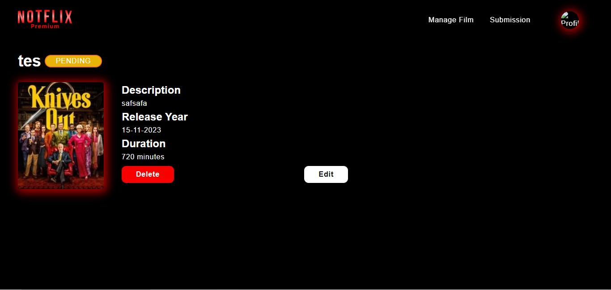

# Notflix Premium App
This is a Notflix Premium App created with ReactTS, Vite and Tailwind.


## Prerequisites
1. Make sure your machine has Docker and Docker Compose installed.


## How To Run
1. Make an .env file based of .env.example
2. Navigate to the root directory of the project.
3. Run the following command:

    ```
    docker-compose up -d
    ```
This will start the Notflix REST Service application using Docker containers.

## Screenshots





## Task Division
| Page            | NIM          |
|---------------------|--------------|
| **Login**           | 13521130     |
| **Registration**    | 13521130     |
| **Manage Film**    | 13521132     |
| **Detail Film**    | 13521132     |
| **Edit Film**    | 13521132     |
| **Submission**    | 13521132     |
| **Edit Submission**    | 13521132     |
| **Create Submission**    | 13521132     |
| **Manage Subscription**    | 13521165     |
| **Film Request**    | 13521165     |
| **Profile**    | 13521132     |
| **Edit Profile**    | 13521132     |